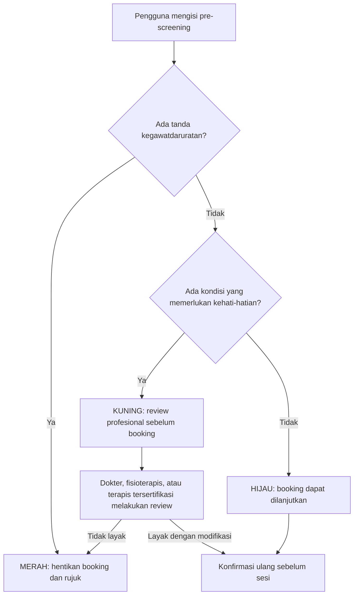
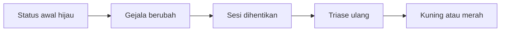

# UPDATE.md — Fitur Baru: Sistem Triase (Safety Gate Sebelum Booking Pijat)

> Dokumen ini merangkum spesifikasi fitur **Triase Hijau–Kuning–Merah** dari `Inovasi_Teknologi_Kesehatan.pdf` (disebut "PressPoint" di sumber, disatukan di sini ke konteks proyek **TitikTemu**), dan menerjemahkannya menjadi update teknis yang siap diintegrasikan ke `CLAUDE.md` dan `FEATURE.md`.
>
> **Asumsi yang diambil:** fitur triase ini adalah **gerbang keselamatan baru** yang dijalankan **sebelum** alur booking/konsultasi terapi (baik pain mapping maupun booking terapis), bukan pengganti fitur yang sudah ada. Jika nama produk "PressPoint" ternyata berbeda dari "TitikTemu" (produk terpisah), beri tahu saya agar dokumen ini dipisah, bukan digabung.

---

## 1. Mengapa Fitur Ini Perlu Ditambahkan

Fitur-fitur yang sudah ada di `CLAUDE.md` (pain mapping 3D, dual dashboard, evaluasi training) berasumsi bahwa pasien **sudah aman** untuk menerima terapi pijat. Padahal, ada risiko besar yang belum ditangani: **pengguna dengan kondisi berbahaya (misal red flag neurologis, kardiopulmoner, infeksi berat) bisa saja langsung booking pijat tanpa ada yang menyaring kondisinya terlebih dahulu.**

Sistem triase ini mengisi gap tersebut sebagai **lapisan paling awal** dalam perjalanan pengguna, sebelum pain mapping 3D maupun booking terapis dijalankan.

### 1.1 Prinsip Dasar
- Triase **bukan** untuk menjawab "penyakit apa yang diderita pengguna?".
- Triase **menjawab**: *"Apakah pengguna aman melanjutkan booking pijat, membutuhkan penilaian profesional terlebih dahulu, atau harus segera mencari pertolongan medis?"*
- Sistem ini adalah **gerbang keselamatan (safety gate)**, bukan alat diagnosis.

---

## 2. Tiga Kategori Triase

| Aspek | 🟢 Hijau | 🟡 Kuning | 🔴 Merah |
|---|---|---|---|
| Red flag | Tidak ada | Tidak jelas / ada faktor kehati-hatian | Ada |
| Tingkat risiko | Rendah | Belum dapat dipastikan | Tinggi |
| Booking | Langsung dibuka | Ditahan untuk review | Diblokir |
| Pijat | Dapat dipertimbangkan | Mungkin dengan modifikasi | Tidak dilakukan |
| Review manusia | Tidak wajib sebelum booking | Wajib | Wajib melalui layanan medis |
| Rujukan | Jika tidak membaik | Sebelum/bersamaan dengan layanan | Segera |
| Follow-up | 24–72 jam | Lebih cepat & ketat | Di luar jalur terapis |

### 2.1 🟢 Kategori Hijau
**Definisi:** nyeri muskuloskeletal mekanis ringan–menengah, tidak ada red flag, tidak ada kondisi khusus yang butuh persetujuan profesional, fungsi tubuh relatif terjaga.

**Catatan penting:** hijau **bukan berarti** pengguna "pasti sehat" atau "pijat pasti menyembuhkan" — hanya berarti tidak ditemukan indikator utama yang mengharuskan booking dihentikan/ditinjau dulu.

**Indikasi (semua kondisi berikut harus terpenuhi):**
- *Karakteristik nyeri:* muncul setelah aktivitas berulang/posisi statis; terasa pegal/tegang/kaku; lokasi jelas & terbatas; berubah sesuai gerakan/posisi; membaik dengan istirahat; skala 1–6/10; tidak memburuk cepat; masih bisa berjalan/bergerak; tidak ada cedera berat baru.
- *Tidak ada gejala neurologis:* tidak ada kelemahan baru, mati rasa progresif, gangguan keseimbangan baru, baal di area genital/bokong/paha dalam, atau gangguan BAK/BAB.
- *Tidak ada gejala sistemik:* tidak demam, menggigil, penurunan berat badan tanpa sebab, keringat malam tidak biasa, atau lemas berat.
- *Tidak ada kondisi lokal berisiko:* tidak ada luka terbuka, kemerahan/panas berat, pembengkakan mendadak, perubahan bentuk tulang/sendi, dugaan infeksi, atau memar luas akibat trauma berat.

**Tindakan sistem:** booking dibuka → rekomendasi terapis sesuai kompetensi → ringkasan keluhan dikirim ke terapis → pengguna isi persetujuan tindakan → konfirmasi ulang screening sebelum sesi → follow-up setelah terapi.

### 2.2 🟡 Kategori Kuning
**Definisi:** tidak ada tanda kegawatdaruratan, tetapi ada kondisi yang membuat terapi tidak boleh langsung dilakukan tanpa review/modifikasi. Booking **tidak otomatis ditolak**, tetapi wajib ditinjau tenaga kompeten dulu.

**Enam kelompok indikasi kuning:**

| Kelompok | Contoh Kondisi |
|---|---|
| A. Nyeri cukup berat/menetap | Skala 7–8/10 tanpa tanda darurat lain; berlangsung >beberapa minggu; sering berulang; tidak membaik setelah beberapa kali terapi; mengganggu tidur/pekerjaan; mulai menyebar |
| B. Gejala neurologis ringan & tidak progresif | Kesemutan ringan sesekali; mati rasa terbatas & tidak memburuk; nyeri menjalar tanpa kelemahan; riwayat saraf terjepit yang stabil |
| C. Cedera ringan/subakut | Terkilir/memar ringan; cedera olahraga tanpa perubahan bentuk; masih bisa gerak; tanpa bunyi patah/ketidakstabilan berat |
| D. Kondisi medis khusus | Kehamilan; usia lanjut dengan kerapuhan tulang; osteoporosis; diabetes dengan gangguan sensasi; pengencer darah; gangguan pembekuan darah; riwayat operasi/patah tulang baru; penyakit jantung stabil; kanker yang ditangani; autoimun; varises berat; implan/prostesis; hipertensi tak terkontrol; pasca melahirkan; anak/remaja |
| E. Kondisi lokal yang perlu dihindari | Luka ringan yang sembuh; ruam; infeksi kulit lokal; memar; pembengkakan ringan; area bekas operasi; benjolan belum diperiksa; nyeri sekitar implan |
| F. Informasi tidak lengkap/tidak konsisten | Banyak pertanyaan dilewati; jawaban berubah-ubah; AI gagal memahami keluhan; foto/data tidak jelas |

> **Aturan penting kelompok F:** sistem **tidak boleh menebak**. Ketidakpastian data harus menghasilkan kategori kuning (butuh review manusia), bukan diasumsikan aman.

**Tindakan sistem:** booking sementara ditahan/provisional → arahkan ke *quick review* oleh fisioterapis/dokter/petugas klinis → jika disetujui, beri batasan (terapis tertentu, tekanan ringan, area dihindari sebagai *restricted zone*, durasi lebih pendek, follow-up lebih cepat) → jika tidak sesuai, rujuk.

### 2.3 🔴 Kategori Merah
**Definisi:** indikasi kondisi serius — cedera berat, infeksi, gangguan saraf, gangguan vaskular, atau kegawatdaruratan lain. Booking pijat **dihentikan**, arahkan ke pertolongan medis.

Dibagi dua tingkat urgensi:

#### 3A. Merah Darurat (butuh IGD/pertolongan segera)
- **Gangguan saraf berat:** kelemahan baru/progresif; tiba-tiba tidak bisa jalan; kedua kaki lemah/mati rasa; hilang kontrol BAK/BAB; mati rasa area saddle (genital/bokong/paha dalam); gangguan fungsi seksual baru + nyeri punggung; penurunan kesadaran; bicara/wajah mencong mendadak. *(indikasi kemungkinan cauda equina syndrome — butuh penilaian darurat)*
- **Gejala kardiopulmoner:** nyeri dada; sesak napas; pingsan/hampir pingsan; batuk darah; nyeri punggung/bahu + sesak/keringat dingin.
- **Dugaan bekuan darah (DVT/emboli paru):** satu kaki tiba-tiba bengkak; nyeri betis/paha; kulit hangat & kemerahan; terutama jika disertai sesak/nyeri dada.
- **Trauma berat:** kecelakaan kendaraan; jatuh dari ketinggian; benturan keras; perubahan bentuk tubuh; dugaan patah tulang; tidak bisa menahan berat badan; perdarahan; nyeri hebat mendadak setelah trauma.

**Tindakan sistem:** booking dikunci → tombol "Cari pertolongan sekarang" → tampilkan nomor darurat 119/fasilitas gawat darurat terdekat → anjurkan tidak memijat/memanipulasi area → minta hubungi orang terdekat → **jangan tampilkan rekomendasi terapis** → catat alasan triase untuk audit (dengan persetujuan & perlindungan data).

#### 3B. Merah Mendesak (butuh periksa medis secepatnya, tidak selalu ambulans)
- **Dugaan infeksi/inflamasi berat:** demam + nyeri; sendi merah-panas-bengkak; luka bernanah; kemerahan menyebar; menggigil; kondisi umum memburuk.
- **Kemungkinan keganasan/penyakit sistemik:** riwayat kanker + nyeri baru; penurunan berat badan tanpa sebab; nyeri terus-menerus saat istirahat; nyeri malam berat tak berubah posisi; benjolan keras; keringat malam/kelelahan berat.
- **Cedera yang mungkin berat:** tidak bisa pakai anggota tubuh; sendi tidak stabil; pembengkakan cepat; memar luas; bunyi "pop" + kehilangan fungsi; nyeri tajam sangat berat setelah cedera; dugaan dislokasi/patah.
- **Gejala memburuk cepat:** nyeri meningkat drastis dalam hitungan jam/hari; mati rasa meluas; kesemutan berubah jadi kelemahan; fungsi gerak terus menurun.

**Tindakan sistem:** booking dihentikan → anjurkan periksa hari yang sama/secepatnya → tawarkan fasilitas kesehatan (bukan terapis) → status dapat ditinjau ulang setelah pengguna dapat *clearance* dari tenaga medis.

---

## 3. Alur Triase (Diagram)



**Alur re-screening (kondisi bisa berubah setelah booking, sebelum sesi berlangsung):**



Terapis wajib mengonfirmasi ulang sebelum sesi dimulai dengan pertanyaan seperti: *"Sejak Anda melakukan booking, apakah muncul demam, pembengkakan, mati rasa, kelemahan, trauma baru, nyeri dada, atau sesak napas?"* Jika muncul indikator baru → sesi dihentikan → triase ulang → kategori naik ke kuning/merah.

---

## 4. Logika Keputusan — Hard-Stop Rules (Bukan Skor Total)

**Prinsip kunci:** satu red flag harus mampu mengalahkan hasil skor lain. Contoh: meskipun *pain score* hanya 3/10, jika pengguna kehilangan kontrol berkemih, hasilnya tetap **MERAH**.

### 4.1 Pseudocode Referensi (dari sumber)
```
IF gangguan_kandung_kemih = ya
OR mati_rasa_area_saddle = ya
OR kelemahan_progresif = ya
OR nyeri_dada = ya
OR sesak_napas = ya
OR trauma_berat = ya
THEN kategori = MERAH

ELSE IF demam_dengan_nyeri = ya
OR sendi_merah_panas_bengkak = ya
OR penurunan_berat_badan_tanpa_sebab = ya
OR riwayat_kanker_dengan_nyeri_baru = ya
THEN kategori = MERAH_MENDESAK

ELSE IF hamil = ya
OR osteoporosis = ya
OR obat_pengencer_darah = ya
OR operasi_baru = ya
OR nyeri >= 7
OR nyeri_persisten = ya
OR kesemutan_ringan = ya
OR jawaban_tidak_lengkap = ya
THEN kategori = KUNING

ELSE kategori = HIJAU
```

### 4.2 Implementasi Wajib di Backend Java (Mengikuti Arsitektur `CLAUDE.md`)

Fitur ini **wajib** menggunakan **Chain of Responsibility Pattern** untuk hard-stop rules (bukan if-else besar yang sulit di-maintain), agar konsisten dengan gaya arsitektur solid yang sudah ditetapkan di proyek ini (Generic Repository, Singleton, Graph traversal untuk fitur lain).

```java
public enum TriageCategory {
    HIJAU, KUNING, MERAH_MENDESAK, MERAH_DARURAT
}

public interface TriageRule {
    Optional<TriageCategory> evaluate(TriageAnswers answers);
    int priority(); // makin kecil = makin diprioritaskan (red flag darurat = priority tertinggi)
}

public class TriageEngine {
    private final List<TriageRule> rules; // sudah terurut berdasarkan priority()

    public TriageResult run(TriageAnswers answers) {
        for (TriageRule rule : rules) {
            Optional<TriageCategory> result = rule.evaluate(answers);
            if (result.isPresent()) {
                return TriageResult.of(result.get(), rule); // rule yang trigger dicatat untuk audit
            }
        }
        return TriageResult.of(TriageCategory.HIJAU, null);
    }
}
```

- Setiap kelompok red flag (neurologis berat, kardiopulmoner, DVT, trauma berat, infeksi/inflamasi berat, keganasan, kondisi medis khusus, dll.) diimplementasikan sebagai **satu `TriageRule` terpisah** — bukan digabung dalam satu method raksasa. Ini memudahkan unit test per rule dan memudahkan audit/perubahan kriteria medis di kemudian hari tanpa menyentuh rule lain.
- `TriageResult` **wajib disimpan** melalui `TreatmentRepository<T>` generic yang sudah ada (buat `TriageRecord extends TreatmentRecord`, sama seperti pola `TrainingEvaluationRecord`), dan dicatat lewat `DiagnosisLogger` singleton untuk keperluan audit — sesuai instruksi eksplisit sumber: *"Catat alasan triase untuk audit, dengan persetujuan dan perlindungan data."*
- **Wajib unit test JUnit 4** untuk setiap `TriageRule`, khususnya kasus di mana skor nyeri rendah tapi red flag tetap men-trigger MERAH (contoh kasus di atas), untuk membuktikan hard-stop benar-benar mengalahkan skor total.

---

## 5. Pertanyaan Pre-Screening (Struktur Bertahap)

Sistem menampilkan pertanyaan **satu per satu**, berhenti secepat mungkin begitu red flag terdeteksi (tidak perlu menyelesaikan semua pertanyaan jika sudah jelas merah).

### Tahap 1 — Emergency Gate
1. Apakah Anda mengalami nyeri dada atau sesak napas?
2. Apakah Anda tiba-tiba kehilangan kekuatan pada tangan atau kaki?
3. Apakah Anda kehilangan kontrol buang air kecil atau besar?
4. Apakah Anda mengalami mati rasa di sekitar genital, bokong, atau paha dalam?
5. Apakah nyeri muncul setelah kecelakaan atau benturan berat?
6. Apakah salah satu kaki tiba-tiba bengkak, merah, hangat, dan nyeri?

→ Jika salah satu **"Ya"**: screening langsung dihentikan, kategori **MERAH**.

### Tahap 2 — Urgent Clinical Gate
1. Apakah Anda demam atau menggigil?
2. Apakah area nyeri merah, panas, atau membengkak?
3. Apakah terdapat luka terbuka atau infeksi?
4. Apakah berat badan turun tanpa direncanakan?
5. Apakah Anda memiliki riwayat kanker dan sekarang mengalami nyeri baru?
6. Apakah nyeri terus memburuk atau membangunkan Anda setiap malam?
7. Apakah Anda tidak dapat berjalan atau menggunakan bagian tubuh tersebut?

→ Jawaban **"Ya"**: kategori **MERAH_MENDESAK** atau review klinis sesuai protokol.

### Tahap 3 — Precaution Gate
1. Berapa skala nyeri Anda? (0–10)
2. Sudah berapa lama keluhan berlangsung?
3. Apakah nyeri pernah ditangani sebelumnya?
4. Apakah Anda sedang hamil?
5. Apakah Anda memiliki osteoporosis?
6. Apakah Anda menggunakan pengencer darah?
7. Apakah Anda baru menjalani operasi?
8. Apakah Anda mengalami kesemutan atau mati rasa ringan?
9. Apakah Anda memiliki diabetes atau gangguan sensasi?
10. Apakah Anda memiliki implan pada area tersebut?

→ Jawaban tertentu memasukkan pengguna ke kategori **KUNING**.

---

## 6. Peran AI vs Tenaga Manusia (Batasan Wajib)

**AI boleh digunakan untuk:**
- Memahami bahasa bebas pengguna (free-text symptom description).
- Menyusun ringkasan gejala.
- Mendeteksi jawaban yang kontradiktif.
- Memastikan pertanyaan penting tidak terlewat.
- Merekomendasikan pertanyaan lanjutan.
- Menjalankan rule engine (Bagian 4.2).
- Mengidentifikasi perubahan dari screening sebelumnya (re-screening, Bagian 3).

**AI tidak boleh — hard constraint di level prompt & validasi output:**
- Menyatakan diagnosis.
- Menjamin bahwa pijat aman.
- Mengabaikan red flag karena skor probabilitas rendah.
- Mengarahkan kondisi merah ke terapis.

> **Implikasi teknis:** response dari `AiApiClient`/model AI yang dipakai fitur ini **wajib divalidasi ulang oleh `TriageEngine` rule-based** (Bagian 4.2) sebelum ditampilkan ke pengguna — AI hanya membantu *mengisi/melengkapi/meringkas* jawaban, **bukan** yang memutuskan kategori akhir. Keputusan akhir kategori **selalu** berasal dari hard-stop rules deterministik, bukan dari output generatif AI.

---

## 7. Dampak Terhadap Dokumen Proyek yang Sudah Ada

### 7.1 Perubahan yang perlu masuk ke `CLAUDE.md`
- Tambahkan **Bagian baru**: "Fitur 5 — Sistem Triase (Safety Gate)" setelah Bagian 5 (Evaluasi Training) yang sudah ada, mendeskripsikan alur ini sebagai **gerbang pertama** sebelum pain mapping/booking.
- Update **Bagian 1.2 (Alur Solusi)**: triase menjadi langkah paling awal, sebelum pasien mewarnai model 3D.
- Update **Bagian 6.1 (Generic Repository)**: tambahkan `TriageRecord extends TreatmentRecord` sebagai tipe ketiga/keempat yang kompatibel.
- Tambahkan pola desain baru di **Bagian 6**: **Chain of Responsibility** untuk `TriageRule`, melengkapi Generic Repository & Singleton yang sudah ada — ini menambah bobot teknis proyek untuk dipresentasikan ke juri.
- Update **Bagian 9 (Demo Flow)**: tambahkan langkah triase di awal alur utama, sebelum langkah "Tampilkan model 3D manusia".
- Tambahkan disclaimer tambahan di **Bagian 12**: kerangka triase ini **perlu divalidasi oleh dokter, fisioterapis, atau ahli kedokteran fisik & rehabilitasi**, serta disesuaikan dengan regulasi Indonesia sebelum digunakan secara nyata (pernyataan eksplisit dari sumber dokumen).

### 7.2 Task baru yang perlu masuk ke `FEATURE.md`
Disarankan menjadi **EPIC baru** (mis. "EPIC -1 — Sistem Triase / Safety Gate", dikerjakan **sebelum** EPIC 1 karena ini gerbang paling awal dalam user journey):

- 🔴 Implementasi `TriageAnswers`, `TriageCategory`, `TriageRecord`.
- 🔴 Implementasi `TriageRule` per kelompok red flag (minimal: neurologis berat, kardiopulmoner, DVT, trauma berat → MERAH_DARURAT; infeksi berat, keganasan → MERAH_MENDESAK; kondisi medis khusus, nyeri berat, data tidak lengkap → KUNING).
- 🔴 Implementasi `TriageEngine` (Chain of Responsibility) + unit test hard-stop (skor rendah tapi red flag tetap menang).
- 🔴 Endpoint `POST /api/triage/screen` (tahap emergency/urgent/precaution gate, bisa satu endpoint bertahap atau tiga endpoint terpisah per gate).
- 🟡 Frontend: form pertanyaan bertahap (satu per satu, auto-stop begitu red flag terdeteksi).
- 🟡 Frontend: halaman hasil per kategori (hijau → lanjut ke pain mapping; kuning → status "menunggu review"; merah → tombol darurat + nomor 119, tanpa rekomendasi terapis).
- 🟡 Endpoint `POST /api/triage/rescreen` untuk re-screening sebelum sesi (Bagian 3).
- 🟢 Dashboard review untuk tenaga profesional (dokter/fisioterapis) menindaklanjuti kategori kuning.

---

## 8. Catatan Validasi (Wajib Dibaca Sebelum Implementasi Nyata)

Kerangka triase ini bersumber dari rujukan seperti NICE guideline (NG59) dan NHS untuk red flag nyeri punggung (cauda equina, DVT/emboli paru), tetapi **tetap perlu divalidasi oleh dokter, fisioterapis, atau ahli kedokteran fisik dan rehabilitasi**, serta disesuaikan dengan regulasi kesehatan di Indonesia sebelum dipakai untuk pengguna sungguhan — ini bukan pengganti pemeriksaan medis profesional. Untuk prototipe/demo, kerangka ini cukup diimplementasikan sebagai bukti arsitektur (rule engine + audit trail), dengan disclaimer yang jelas di UI bahwa hasil triase belum tervalidasi klinis.
